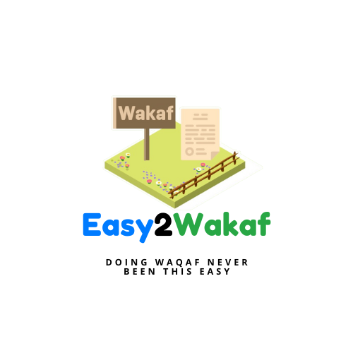
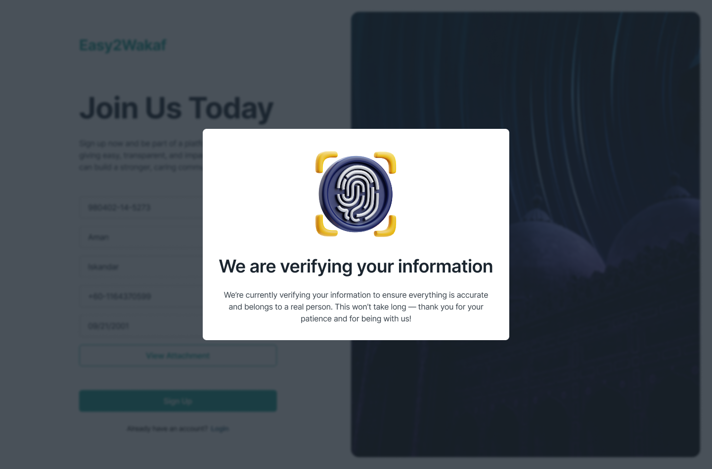
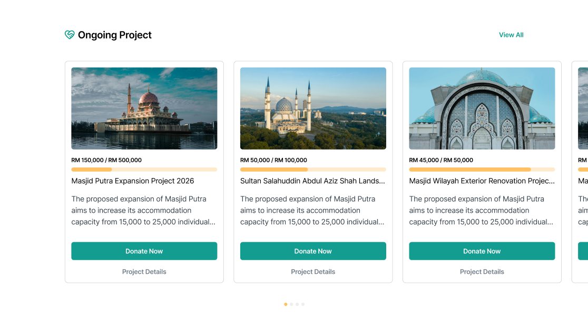
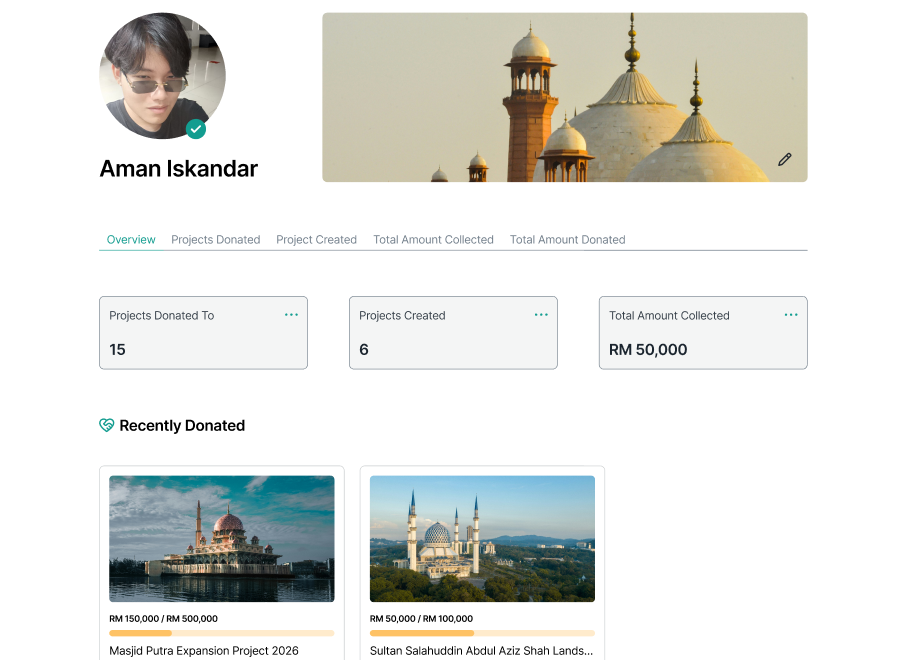

# 🌍 Easy2Wakaf: Centralized Waqf Donation Platform for Malaysia

## 🚀 Submission for UMHackathon 2025
**Track:** Securities Commission Malaysia  
**Problem Statement:** Enhancing Charity & Donations through Fintech & Technology  
**Theme:** Centralized Waqf Collection Across All States in Malaysia  

---

## 🧠 Inspiration
While Waqf remains a powerful pillar of Islamic social finance, its potential is often hindered by siloed operations, lack of digital adoption, and transparency issues. We're on a mission to digitize and centralize Waqf donation systems across Malaysia, unifying state Waqf boards under one trusted and Shariah-compliant platform.

---

## 💡 What It Does
**Easy2Wakaf** is a fintech-powered platform that allows:
- 💸 **Centralized Waqf Collection:** Donors can contribute to verified projects across Malaysian states.
- 🔎 **Transparent Tracking:** Real-time fund visibility using dashboards and blockchain-inspired integrity.
- 📊 **Impact Analytics:** Interactive PowerBI dashboards to monitor fund utilization and social outcomes.
- 🤖 **AI-Powered Validation:** OpenCV and Gemini for document analysis, donor verification, and fraud detection.
- 📄 **Auto-generated Receipts:** Waqf receipts generated with WeasyPrint for legal and zakat purposes.
- 📱 **Modern UX/UI:** Clean, user-friendly interfaces designed with Figma and Canva.

---

## 🛠️ Tech Stack
| Tech         | Purpose |
|--------------|---------|
| **Django**   | Backend API & Admin Panel |
| **React**    | Frontend SPA for donors and admins |
| **MongoDB**  | NoSQL DB for high-scalability & flexibility |
| **Stripe**   | Secure online payment gateway |
| **WeasyPrint** | PDF generation for donation receipts |
| **OpenCV**   | Identity/document verification |
| **Gemini**   | AI-powered insights and automation |
| **Power BI** | Real-time data dashboards |
| **Canva/Figma** | UI/UX Design Prototypes |

---

## 🔗 Design & Prototypes

- 🎨 [Figma UI/UX Design](https://www.figma.com/design/DToBf1JwaQ5XdFyBHxLWSL/Easy2Waqf?node-id=0-1&p=f&t=WAbUJijSyXRBF7KA-0)
- 📊 [Canva Pitch Deck](./Easy2WaqfPitchDeck.pdf)

---

## 📸 Screenshots Preview

| Verification Page | Home Page | Profile Page |
|-----------------|-------------------|-------------|
|  |  |  |

---

## 📦 Key Features
- 📍 **Geolocated Project Discovery**
- 📥 **Project Pooling & Smart Allocation**
- 💼 **Admin Dashboard for States**
- 📧 **Automated Email Receipts & Certificates**
- 🔐 **Secure Auth with Donor History**

---

## 📈 Impact Goals
- Increase in Waqf donor retention through transparency.
- Boost inter-state collaboration and fund optimization.
- Enable underserved communities to access Waqf benefits digitally.

---

## 🛡️ Shariah Compliance
We worked closely with guidelines from Jabatan Wakaf, Zakat dan Haji (JAWHAR) to ensure our models, flows, and smart distribution comply with Islamic finance principles.

---

## 🧑‍💻 Team
- **Team Name:** [That One Time When Me And Bros Decided To Join Hackathon And We Actually Win]
- **Members:** [Aman Iskandar], [Hakimi Mahadzir], [Maxwell Jared], [Jawwad Kabir], [Amir Izzhan]
- **Institution:** University of Malaya

---

## 📬 Contact
📧 [Aman Iskandar]  
🔗 [Linkedin](https://www.linkedin.com/in/aman-iskandar-mohamad-dzulhaidi-723932249/)

📧 [Hakimi Mahadzir]  
🔗 [Linkedin](https://www.linkedin.com/in/hakimi-mahadzir-a16039295/)

📧 [Maxwell Jared]  
🔗 [Linkedin](https://www.linkedin.com/in/maxwell-jared-daniel-215927298/)

📧 [Jawwad Kabir]  
🔗 [Linkedin](https://www.linkedin.com/in/jawwad-kabir/)

📧 [Amir Izzhan]  
🔗 [Email](mamirizzan04@gmail.com)

---

> “Digitizing Waqf, Empowering Ummah.”  
> Let’s revolutionize Islamic charity for a better tomorrow.
